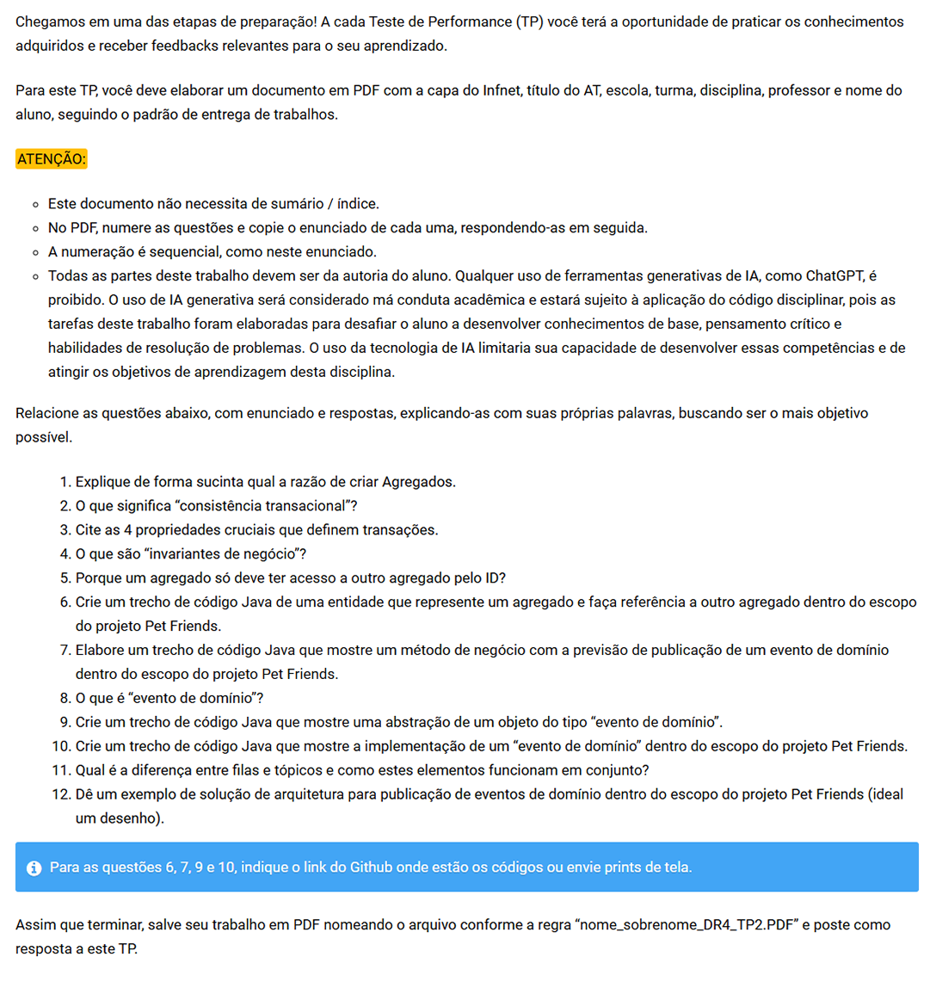

# V-2-Domain-Driven Design (DDD) e Arquitetura de Softwares Escaláveis com Java

## TP2 - Questões (12)

### Modo de Uso:
- Para as questões 06 e 07 tem uma pasta com o projeto dentro
- Para as questões 09 e 10 tem uma pasta com o projeto dentro
- Para as questões 12 tem um arquivo "petfriends-event.puml" na raiz da pasta TP2

