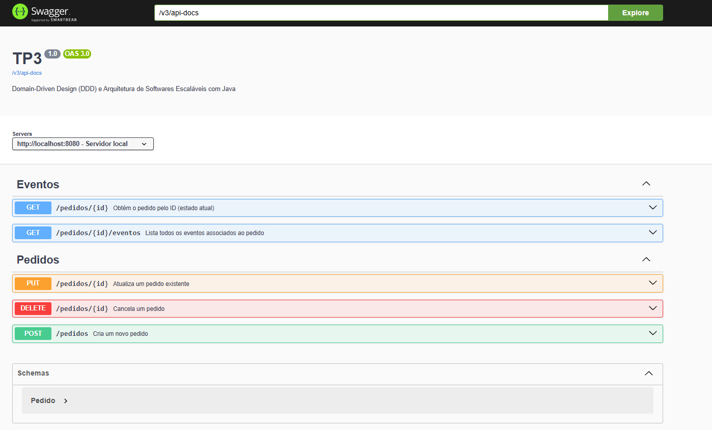
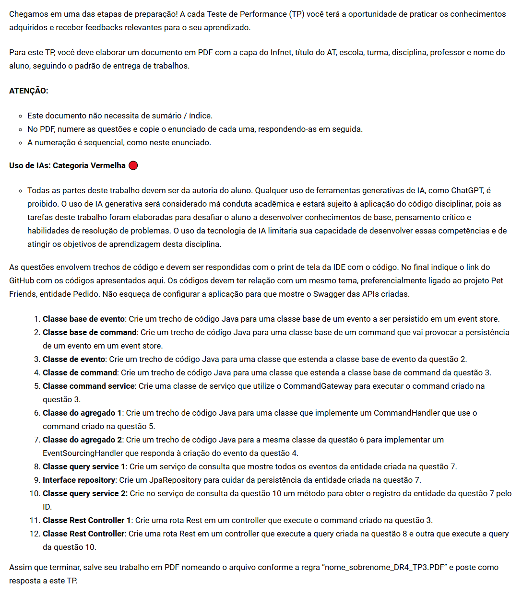

# V-2-Domain-Driven Design (DDD) e Arquitetura de Softwares Escaláveis com Java

## TP3 - Questões (12)

## Swagger
http://localhost:8080/swagger-ui/index.html#

## Banco de dados H2
http://localhost:8080/h2-console

### Respostas:
### 1 -  https://github.com/faculdade-infnet/V-2-DDD_e_Arquitetura-de-Softwares-Escalaveis-com-Java/blob/main/TP3/TP3-projeto/src/main/java/br/edu/infnet/event/BaseEvent.java
### 2 -https://github.com/faculdade-infnet/V-2-DDD_e_Arquitetura-de-Softwares-Escalaveis-com-Java/blob/main/TP3/TP3-projeto/src/main/java/br/edu/infnet/command/BaseCommand.java
### 3 - https://github.com/faculdade-infnet/V-2-DDD_e_Arquitetura-de-Softwares-Escalaveis-com-Java/blob/main/TP3/TP3-projeto/src/main/java/br/edu/infnet/event/PedidoCriadoEvent.java
### 4 - https://github.com/faculdade-infnet/V-2-DDD_e_Arquitetura-de-Softwares-Escalaveis-com-Java/blob/main/TP3/TP3-projeto/src/main/java/br/edu/infnet/command/CriarPedidoCommand.java 
### 5 - https://github.com/faculdade-infnet/V-2-DDD_e_Arquitetura-de-Softwares-Escalaveis-com-Java/blob/main/TP3/TP3-projeto/src/main/java/br/edu/infnet/service/PedidoCommandServiceImpl.java
### 6 - https://github.com/faculdade-infnet/V-2-DDD_e_Arquitetura-de-Softwares-Escalaveis-com-Java/blob/main/TP3/TP3-projeto/src/main/java/br/edu/infnet/model/Pedido.java 
### 7 - https://github.com/faculdade-infnet/V-2-DDD_e_Arquitetura-de-Softwares-Escalaveis-com-Java/blob/main/TP3/TP3-projeto/src/main/java/br/edu/infnet/event/PedidoEventHandler.java 
### 8 - https://github.com/faculdade-infnet/V-2-DDD_e_Arquitetura-de-Softwares-Escalaveis-com-Java/blob/main/TP3/TP3-projeto/src/main/java/br/edu/infnet/service/PedidoQueryService.java
### 9 - https://github.com/faculdade-infnet/V-2-DDD_e_Arquitetura-de-Softwares-Escalaveis-com-Java/blob/main/TP3/TP3-projeto/src/main/java/br/edu/infnet/repository/PedidoRepository.java
### 10 - https://github.com/faculdade-infnet/V-2-DDD_e_Arquitetura-de-Softwares-Escalaveis-com-Java/blob/main/TP3/TP3-projeto/src/main/java/br/edu/infnet/service/PedidoQueryService.java
### 11 - https://github.com/faculdade-infnet/V-2-DDD_e_Arquitetura-de-Softwares-Escalaveis-com-Java/blob/main/TP3/TP3-projeto/src/main/java/br/edu/infnet/controller/PedidoCommandController.java
### 12 - https://github.com/faculdade-infnet/V-2-DDD_e_Arquitetura-de-Softwares-Escalaveis-com-Java/blob/main/TP3/TP3-projeto/src/main/java/br/edu/infnet/controller/PedidoQueryController.java

### Enuunciado:

